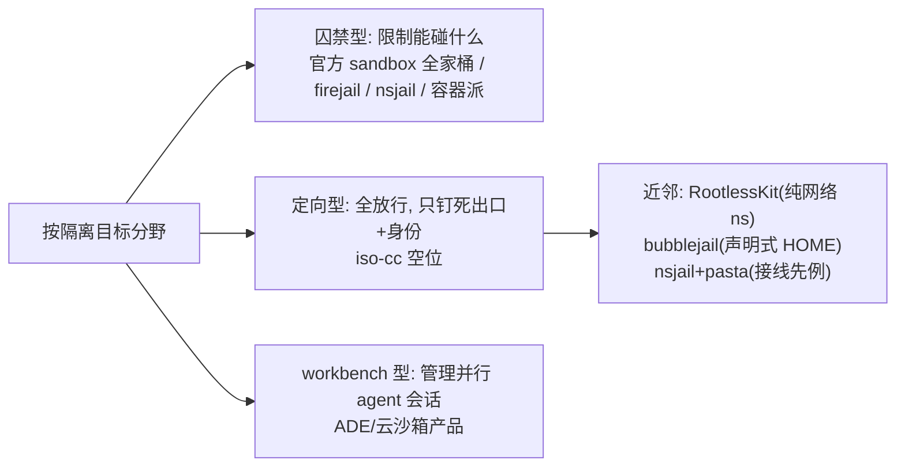

# 相关项目扫描（Q1）与环境纯净度探针（Q2）

日期：2026-09-26 ｜ 状态：研究笔记（info-only，不改需求基线 `docs/REQUIREMENTS.md`）
方法：全部论断溯源到一手来源（GitHub 仓库/官方文档/man page/npm 产物本体）；标注 `[实测]` 的条目为本机 2026-09-26 实际运行验证；二进制取证基于本机安装的 claude-code 2.1.263（nix store 构建产物），属一手证据但随版本演进。

---

## TL;DR

- **官方侧（Anthropic）三条沙箱路线全部是"囚禁型"**：内建 sandboxed Bash（macOS Seatbelt / Linux bubblewrap+socat）、`@anthropic-ai/sandbox-runtime`（bwrap + 命名空间内网络整体移除 + host 侧域名 allowlist 代理）、官方 devcontainer（default-deny iptables）。它们的目标是限制 cc 能碰什么；iso-cc 的目标是**放行一切、只钉死出口**（R3 最小侵入），定位正交、无冲突。
- **官方 devcontainer 的 `init-firewall.sh` 有两个 iso-cc 已知但值得记录的坑**：无 `ip6tables`（IPv6 完全不设防）[实测：脚本 0 处 ip6tables]；DNS 放行是"任意目的 :53"而非钉死解析器。trailofbits 的 README 诚实承认了同样的 IPv6 缺口——这正好印证 R8"v6 默认关 + fail-closed"的验收价值。
- **最接近 iso-cc 机制的先例是 nsjail（已内置 pasta 用户态网络）与 RootlessKit（`--net=pasta|slirp4netns` + `--copy-up`）**，但没有一个做"locale/TZ 覆盖 + CC 配置 mountns 重定向 + egress 接口钉死"的组合；bubblejail 的 `services.toml` 声明式资源授予是配置模型上最值得参考的设计。
- **Q2 探针全部可用现成 CLI 免搭建实现**：出口一致性（mullvad/ip-api/ifconfig.co/cloudflare-trace/ipleak 的 JSON 端点）、QUIC（`curl --http3-only`）、locale/TZ 一致性（`date`/`locale`/`readlink /etc/localtime`/Node Intl）、写集（`find ~ -newer`）。本机全部实测通过。
- **cc 自身的环境元数据面**（文档 + 2.1.263 二进制实证）：UA=`claude-cli/<version>`（可带 client-app/workload 后缀）；请求头 `anthropic-client-platform`；Intl 时区被多处使用（含 routines 云代理调度直接上传 `userTimezone`）；Bash 工具 env 块注入 `Platform: linux-x64`、git repo 状态、`Today's date`；遥测经 datadoghq（可关）；WebFetch preflight 固定打 `api.anthropic.com`。**结论：TZ/locale 覆盖必须同时满足"读文件路径"和"Node Intl"两条视线，且 cc 的必达域名清单是 egress doctor 的输入。**

---

## Q1 同类项目扫描

### 1a. 官方侧

#### 官方沙箱能力总览（claude code 文档）

官方对比页把隔离手段分为六档 [来源：sandbox-environments 文档]：

| 方案 | 隔离对象 | 需要 Docker | 备注 |
|---|---|---|---|
| Sandboxed Bash tool | 每条 Bash/PowerShell/Monitor 命令及其子进程 | 否 | 内建；macOS Seatbelt / Linux bwrap |
| Sandbox runtime（`srt`） | 整个 cc 进程（含 file tools/MCP/hooks） | 否 | beta research preview |
| Dev container | 完整开发环境 | 是 | 官方参考实现 default-deny iptables |
| Custom container | 完整开发环境 | 是 | 自管 |
| VM / Docker Sandboxes | 整个 OS | 否（sbx 自带 microVM） | Firecracker 类 |
| Cloud sessions | Anthropic 托管 VM | 否 | 官方网络代理做 allowlist |

关键文档事实：
- Linux 路线依赖 `bubblewrap` + `socat`，可选 seccomp filter（挡 Unix domain socket）；AppArmor 限制（Ubuntu 24.04 `apparmor_restrict_unprivileged_userns`）需要装 bwrap profile——**与我们 R5/P3 面对的是同一个系统约束** [来源：sandboxing 文档]。
- 网络隔离是"域名 allowlist + host 侧代理"模型：sandbox 内网络命名空间被整体移除，流量经 Unix socket bind-mount 出去到 host 的 HTTP/SOCKS 代理 [来源：sandbox-runtime README "How It Works"]。
- `sandbox.failIfUnavailable=true` 可把"沙箱起不来"从警告变成硬失败 [来源：sandboxing 文档]——官方也承认了 fail-open 是默认，这与我们 N1"fail-closed 是唯一失败模式"形成直接对照。
- `--dangerously-skip-permissions` 时官方强制建议放进容器/VM/srt，且容器内不要以 root 跑 [来源：sandbox-environments 文档]。

#### anthropics/sandbox-runtime（`srt`）

| 维度 | 事实 | 来源 |
|---|---|---|
| 机制 | macOS `sandbox-exec`（动态生成 Seatbelt profile）/ Linux bubblewrap（容器化 + **netns 整个移除**）/ Windows 专用本地账号 + WFP egress fence；HTTP 走 HTTP proxy、其他 TCP 走 SOCKS5，双代理跑在 host，经 Unix socket 进沙箱；含 seccomp filter 生成、violation monitor、MITM TLS 代理（证书替换以做域名过滤）、credential 掩蔽（AWS sigv4 重签、env/file 凭据 mask） | README + `src/sandbox/*` 文件清单 |
| rootless | 是（bwrap 无特权） | README |
| 声明式 | 是（JSON schema 配置 allow/deny） | README |
| 宿主持久状态 | 无（进程生命周期）；但需要预创建 `~/.claude`、`~/.claude.json` 空文件才能在 fresh 环境启动——与我们"挂载点缺失预创建 + doctor 报告"的有界例外如出一辙 | README |
| 活跃度/license | stars 5343，pushed 2026-09-25，Apache-2.0 | gh api [实测] |
| 与 iso-cc 关系 | **限制型**（allowlist 域名，默认全拒）vs 我们的**定向型**（全部放行、只换出口）；可叠加使用（srt 套在 iso-cc 会话内） | 定位分析 |

**值得偷**：violation monitor（违规写/连网的实时上报，映射到我们 T5 的泄漏告警形态）；"empty allowlist = 全拒"的语义；启动时对配置加载失败的处理（`--settings` 加载失败拒绝启动——doctor 应同样 fail-loud）。
**要避开**：它把网络管控做在应用层代理上（TLS 需 MITM 才能过滤域名），我们 R1 已拒绝应用层方案（可被绕过、非强制）；它的 Linux deny 列表"launch 时一次性构建、不覆盖会话后新建文件"的语义边界也提示我们：**声明式 mountns 重定向优于 launch 时快照**。

#### 官方 devcontainer（anthropics/claude-code 仓库 `.devcontainer/`）

一手文件 [实测拉取]：`Dockerfile`（node:20 基础镜像 + iptables/ipset 预装 + `TZ` 构建参数）、`devcontainer.json`、`init-firewall.sh`（136 行）。

`init-firewall.sh` 机制：
1. **default-deny**：`iptables -P OUTPUT DROP` 收尾，全 OUTPUT 默认拒绝。
2. **ipset allowlist**：GitHub IP 段来自 `api.github.com/meta` 动态拉取 + `aggregate` 聚合；域名（npmjs、api.anthropic.com、sentry.io、statsig.com、VS Code marketplace 等）解析后进 `hash:net` ipset。
3. **DNS 例外过宽**：`iptables -A OUTPUT -p udp --dport 53 -j ACCEPT` 对**任意目的地址**放行 53 端口（UDP，未放 TCP），没有钉死解析器——DNS 是出逃通道。
4. **无 IPv6**：全脚本 **0 处 `ip6tables`** [实测 grep]，若容器有 v6 默认路由则整体绕过防火墙（trailofbits 版本明确承认同样问题，见下）。
5. **自校验**：脚本结尾跑 `curl example.com`（期望失败）和 `curl api.github.com/zen`（期望成功）——**与我们 T5 "验收矩阵脚本化"同构，官方也在用冒烟探针验收防火墙**。

**值得偷**：自校验步骤直接内嵌在建立隔离的脚本里（不是分离的 test）；官方维护的 cc 必达域名清单（我们 doctor 的种子数据，见 Q2c）。
**要避开**：iptables 内嵌容器 + root 运行的整条路线（违反 R5 rootless）；DNS :53 全放行；v6 缺失。

#### 其他官方/厂商

- **Cloud sessions**（claude.ai 云会话）：Anthropic 托管 VM，网络代理强制默认 allowlist，GitHub token 存放在沙箱外代理、发 scoped 凭据进去 [来源：sandbox-environments 文档]。
- **Docker Sandboxes（`sbx`，Docker 官方免费产品）**：本地 microVM（自带 daemon 与 workspace sync）或 Docker 托管云；组织级统一网络/文件系统/MCP 策略 [来源：docs.docker.com/ai/sandboxes]。定位是"给 agent 的微 VM workbench"，非轻量会话包装。
- **企业网络面**：官方列出 cc 全部必达 URL（见 Q2c 表）[来源：network-config 文档 "Network access requirements"]——这是 egress doctor 校验解析器可达性的权威依据。

### 1b. 社区 claude-code 包装类

元数据 [实测 gh api，2026-09-26]：

| 项目 | 机制 | rootless | 声明式 | 宿主持久状态 | 活跃度 | license | 备注 |
|---|---|---|---|---|---|---|---|
| trailofbits/claude-code-devcontainer | Docker devcontainer；fs 隔离为主；网络隔离是**文档建议的 iptables+ipset 手工配方**（承认：DNS 仍是 exfil 通道、per-IP allowlist 同 CDN 共址可达、**IPv6 不过滤**、容器有 NET_ADMIN+sudo 可自行改规则、规则重启即失） | 容器内 root（含免密 sudo） | devcontainer.json | 容器+volume（`devc destroy` 才能清干净） | 945★，2026-08-28 | Apache-2.0 | 威胁模型文档极其诚实，"deferred escape"（容器内植入代码等宿主动作触发）是全社区项目里少见的清晰表述 |
| RchGrav/claudebox | Docker 多 profile 镜像（语言栈依赖解析）；per-project 独立镜像/认证/历史/配置；防火墙 allowlist 命令化管理；部分功能要 `--enable-sudo` | Docker 内 | profile 菜单式（半声明式） | Docker 镜像层+auth state 持久 | 1155★，2026-09-17 | MIT | "Per-Project Isolation" 的认证态按项目隔离思路与 R4 per-profile 存储同向 |
| neko-kai/claude-code-sandbox | macOS `sandbox-exec` 配置，限制 fs **读** | macOS 机制 | 单文件 profile | 无 | 60★，2026-09-23 | 无 | Seatbelt 路线的最小参考 |
| zbateson/claude-cage | bubblewrap（Linux/WSL）或 Docker；git filter + fs 隔离 + 可选网络控制；变更可回流；支持并发会话 | 是 | 是 | 会话状态目录 | 4★，2026-06-24 | 无 | 机制上最接近 iso-cc 的小项目（bwrap 包装），可作实现参考 |
| shudza/claude-vm | 纯 bash + QEMU microVM | VM 内 | 脚本管理 | VM 磁盘镜像 | 15★，2026-09-22 | 无 | "强隔离换重量"一档 |
| textcortex/claude-code-sandbox | 本地 Docker 包 cc，免逐条批准 | 容器 | 否 | 容器/卷 | 322★，**已归档**（转 Spritz） | 无 | 归档说明纯容器包装的维护意愿有限 |
| luwojtaszek/cc-sandbox | Docker Desktop/OrbStack 包装 | 容器 | 否 | 容器 | 2★，2026-02-05 | MIT | 生态存在性参考 |

### 1c. 通用 per-app 网络隔离 / 原语封装

| 工具 | 机制 | rootless | 与 iso-cc 的关系 | 来源 |
|---|---|---|---|---|
| firejail | **SUID** 二进制 + namespaces/seccomp/cgroups；`--net` 出独立 netns | 否（SUID root 二进制=持久攻击面） | 反面参照：SUID 是我们要绕开的路（R5） | README [一手] |
| bubblewrap | unprivileged userns/mountns 包装，Flatpak 底座 | 是 | 我们 mountns 动作的参照实现；8841★ 持续维护 | gh api |
| bubblejail (igo95862) | bubblewrap 之上的 per-app 沙箱；**每个 instance 一个独立 HOME**（不是 overlay 原目录）；`services.toml` 声明资源授予（service=一类 socket/资源，profile=预置组合） | 是 | **声明式配置模型的最佳参照**；"独立 HOME 而非 overlay 原 HOME"与 R4 拒绝 HOME 级 overlayfs 的决策互为印证 | README [一手] |
| nsjail | namespaces/cgroups/seccomp(Kafel)；网络隔离支持克隆网卡/MACVLAN/**userland networking (pasta)** | userns 下可 | **pasta 集成的先例**：证明 ns+usernet 路线是成熟组合；可挖它的 pasta 接线方式 | README [一手] |
| proxychains-ng | LD_PRELOAD hook libc 网络函数；**仅 TCP**；自述"basically a HACK"、"不 work 时考虑 iptables 方案" | 是 | R1 拒绝 LD_PRELOAD/env 代理的一手佐证（连作者都劝退） | README [一手] |
| RootlessKit | userns+netns 编排器，net driver 可插拔：`--net=slirp4netns` / `--net=pasta`；`--copy-up=/etc` 把 /etc 复制进 ns 可改（resolv.conf 定制 precedent）；`--disable-host-loopback` 切断到宿主 loopback 的路径 | 是 | `--copy-up` 对应我们 R2 的 mountns bind 覆盖（它是 copy-up，我们是 bind，方向不同：copy-up 产生副本状态，bind 保持宿主透传）；`--disable-host-loopback` 的"默认切断宿主环回"值得在 T3 威胁面里评估 | README [一手] |
| slirp4netns / pasta | 用户态 TCP/IP 栈，接无特权 netns | 是 | 我们的 usernet provider 层（D5）。**passt(1) 确认 `-i/--interface <name>`：用宿主指定接口派生地址与路由**（另有 per-family `--outbound-if4/6`）——R7 的 `if:wg0` 契约与 pasta 实参一一对应 | passt.1 [一手，实测拉取] |
| WireGuard 官方 netns 模式 | `ip netns` 把物理口移进 "physical" ns，wg 口留在 init ns（wg UDP socket 记住出生 ns）；**全程需 root** | 否 | D4 拒绝的"WG 跨 ns socket 技巧"的出处；也证明 netns 路线在无 userns 时代的成本（root+持久 ns 名） | wireguard.com/netns [一手] |

### Q1 小结：定位空间

- **没有找到任何项目同时做**：netns egress 钉死 + locale/TZ mountns 覆盖 + CC 配置 mountns 重定向 + 无 up/down 无宿主状态。iso-cc 的组合定位目前是空的；单点机制均有先例可抄。
- **失败模式黑名单**（他人已踩）：v6 不设防（官方 devcontainer、trailofbits）、DNS :53 全放行（官方 devcontainer）、launch 时快照式 deny 不覆盖后续创建（srt Linux）、SUID 持久面（firejail）、LD_PRELOAD 仅 TCP（proxychains 自认）、容器 volume 残留（trailofbits `devc destroy` 注记）。

---

## Q2 环境纯净度探针

### 2a. VPN 泄漏测试方法学（CLI 可直接复用，均为厂商公开端点或本机实测）

| 探测面 | 工具/端点 | 输出关键字段 | 验证状态 | 来源 |
|---|---|---|---|---|
| 出口 IP/隧道归属 | `curl -s https://am.i.mullvad.net/json` | `ip`, `country`, `city`, `mullvad_exit_ip` | [实测] 返回正常 JSON | Mullvad 官方 blog（API 端点承诺长期保留） |
| v4/v6 分流 | 同上 + `curl -4/-6` 前缀 | v6 泄漏时 `-6` 请求返回原生 ISP 地址 | [实测] 端点可达；`-6` 分流为 Mullvad 文档用法 | 同上 + mullvad.net/help |
| geo+**IP 时区** | `curl "http://ip-api.com/json/?fields=...,timezone,query"` | `timezone: "Australia/Perth"` | [实测] 免费无 key，含 timezone 字段 | ip-api.com 文档字段集 |
| geo+IP 时区（HTTPS） | `curl https://ifconfig.co/json` | `time_zone: "Australia/Melbourne"` | [实测] 注意与 ip-api 对同 IP 给出不同 tz 库结果（Perth vs Melbourne）——**探针要用两个源交叉，或锁定单一源做一致性断言** | ifconfig.co |
| 边缘位置/国家 | `curl -s https://www.cloudflare.com/cdn-cgi/trace` | `loc=AU`, `colo=PER`, `ip=`, `http=` | [实测] | Cloudflare trace（公开约定端点） |
| 综合泄漏 JSON | `curl https://ipleak.net/json/` | `as_number`, `isp_name`, `country_code`, `city_name`… | [实测] AirVPN ipleak 服务的 API | ipleak.net |
| QUIC/UDP 绕过 | `curl --http3-only -o /dev/null -w '%{http_version}' https://cloudflare-quic.com/` | `http_version=3`=QUIC 通；失败=UDP 被 fail-closed 切断（我们 v1 的期望形态） | [实测] 本机 curl 8.21 带 nghttp3，返回 3 | curl 项目（HTTP3 构建要求） |
| DNS 解析路径 | `dig +short whoami.akamai.net`（返回**解析器**出口 IP）；对照 `dig @<声明解析器>` | 两值应一致且= egress 侧解析器 | 本机无 dig 未跑 [实测环境缺失]；命令为 Akamai 公开约定 | Akamai whoami 服务（业界通用方法学） |
| WebRTC（浏览器域） | Mullvad check 页 / browserleaks | 本机 Candidate IP 泄漏 | **CLI 无对应物**（cc 无浏览器）；方法学参照即可 | mullvad check blog |

Mullvad check 页官方检查四项：Using Mullvad VPN / IP 不在黑名单 / No DNS leaks / No WebRTC leaks [来源：官方 blog 配图与正文]。其 DNS 检查的内部实现（随机子域→自有权威 NS 回传解析器身份）为浏览器侧实现，CLI 场景用上表 dig/controlled-zone 法替代 [方法学推断，标注：未读其前端源码]。

浏览器指纹领域（creepjs、browserleaks）作为**方法论参照**：它们把"一致性"定义为多源交叉（IP geo vs TZ vs locale vs 屏幕参数 vs 字体集）的矛盾检测。我们 T5 的 locale 一致性断言就是同一方法在 CLI 的子集；不引入任何浏览器依赖。

### 2b. locale/TZ 一致性 CLI 探针（全部本机实测通过）

| 视线 | 命令 | 本机实测输出 |
|---|---|---|
| libc/日期 | `date +%Z` | `UTC` |
| 系统链接 | `readlink /etc/localtime` | （本机 NixOS 非符号链接，返回空——探针需兼容"文件/链接/缺失"三态，悬空链接视为失败，对应 R2 验收措辞） |
| libc locale | `locale` | `LANG=en_US.UTF-8` |
| **Node Intl**（cc 的视线） | `node -e 'Intl.DateTimeFormat().resolvedOptions().timeZone'` | `UTC`（`locale` 侧 `en-US`，另一条 `resolvedOptions().locale` 视线） |

关键点：cc 实际读取的是 **Node Intl 视线**（见 2c），它经 ICU 读系统 TZ 数据；R2 的 mountns bind 必须让两条视线（`/etc/localtime` 文件路径 + ICU/Intl 解析结果）同时一致，仅注入 `TZ` env 不够（`readlink` 类探查会露馅，R2 已拒绝）。

### 2c. claude code 自身的环境元数据行为

**官方文档层面**：

1. **必达域名表**（network-config 文档 "Network access requirements"，权威 egress 白名单种子）：

| 域名 | 用途 | 可否关 |
|---|---|---|
| `api.anthropic.com` | API 请求 + **WebFetch 域名安全 preflight** + feature flag + 遥测事件 | preflight 可 `skipWebFetchPreflight`，其余不可（第三方 provider 时换端点但 WebFetch preflight 仍打它） |
| `claude.ai` / `claude.com` / `platform.claude.com` | OAuth 登录/刷新 | API-key 模式可不用 |
| `downloads.claude.ai`, `registry.npmjs.org` | 自更新/插件/npx MCP | npm 安装需 registry |
| `http-intake.logs.us5.datadoghq.com` / `browser-intake-us5-datadoghq.com` | 运营遥测 / 错误上报 | `DISABLE_TELEMETRY`、`CLAUDE_CODE_DISABLE_NONESSENTIAL_TRAFFIC`、`DO_NOT_TRACK` 可关 |
| `statsig.com`/`sentry.io`（出现在官方 devcontainer allowlist 里） | feature flag/错误面 | 同上开关族 |

2. **遥测内容边界**：metrics 不含代码/prompt/路径；error report 脱敏后发第三方；Bedrock/Vertex/Foundry 默认全关 [data-usage 文档]。
3. **`claude doctor` / `/doctor`**：安装健康度、无效 settings 文件、未使用扩展、同目录重复 subagent 名、可从代码推导的 CLAUDE.md，附修复建议 [debug-your-config 文档]；`claude doctor`（终端版）为只读诊断 [同文档]。它**会扫描 shell 配置文件** `~/.zshrc ~/.bashrc ~/.config/fish/config.fish`（+macOS bash profile 序列）找过时 alias，路径为目录时曾挂起 [troubleshoot-install 文档]——**cc 自己就是宿主 HOME 的读取者，这佐证 R3"HOME 原样共享"的必要性**。
4. **Remote Control/feature-flag 依赖**：`DISABLE_TELEMETRY` 会连带关掉 feature-flag 评估 [data-usage 文档]——egress 完全断网时 cc 的降级行为应纳入 T5 观察面。

**二进制实证**（claude-code 2.1.263，nix store 产物，`grep -a` 字符串取证）[实测]：

| 行为 | 证据 |
|---|---|
| wire 身份 | UA 构造模板 `` `claude-cli/${VERSION}` `` + 可选 `, client-app/${...}`、`, workload/${...}` 后缀；另有 `anthropic-sdk-typescript/${ver} userOAuthProvider`（SDK 路径）与 `anthropic-client-platform` 请求头 |
| **时区被读取并使用** | 惰性 memoize 的 `Intl.DateTimeFormat().resolvedOptions().timeZone` 多处调用；routines（云代理调度）prompt 组装函数直接携带 `{userTimezone, nowUtcIso, nowLocal, ...}`——**TZ 伪装错误会实际改变 cc 的调度语义** |
| 上下文注入 | `currentDate: "Today's date is ${...}"` 注入 prompt；日期变更事件 "The date has changed. Today's date is now …"；Bash 工具 env 块含 `Platform: ${platform}`（如 `linux-x64`）、`Is directory a git repo: ${bool}` |
| locale 头 | `Accept-Language` 在二进制中仅出现于 i18n 字符串表，**未发现作为 HTTP 头发送** [实测]——HTTP 层 locale 指纹面主要是 UA/平台头 |
| 遥测域名 | `api.anthropic.com`×48、`statsig`×3、`sentry.io`×4 等硬编码字符串，与文档域名表一致 |

**对 iso-cc 验收面的推论**：
- 伪装面优先级：TZ/locale（ Intl 视线）> 平台/OS 字符串（cc 只透传不校验，无需伪装）> HTTP 指纹（UA 固定含版本号，无环境泄漏面）。
- egress doctor 必达域名校验集：`api.anthropic.com`（+provider 端点）+ OAuth 三件套 + `registry.npmjs.org`（npm 安装形态）。
- fail-closed 时（R8）：cc 将表现为对上述域名连接失败；T5 应断言"断网时错误信息不回退宿主路径"。

### 2d. 探针清单 → T5 验收矩阵映射

| # | 探针（会话内执行） | 断言 | 映射 T5/需求 | 出处 |
|---|---|---|---|---|
| P1 | `curl -4 https://am.i.mullvad.net/json`（或 `ip-api.com`/`ifconfig.co`） | `ip` == egress 出口；宿主对照 != | T5 v4 出口；R1 | [实测] 端点 |
| P2 | `curl -6 -m 5 …`（同端点 v6） | **失败**（连接错误），绝不返回宿主 v6 | T5 v6；R8 | Mullvad `-6` 用法 |
| P3 | `dig +short whoami.akamai.net` vs `dig @<声明解析器> whoami.akamai.net` | 相等且 == egress 解析器；`/etc/resolv.conf` 内容 == 声明 | T5 DNS；R1/R8 | Akamai whoami 方法学 |
| P4 | `curl --http3-only https://cloudflare-quic.com/` | 要么 `http_version=3`（走 egress），要么连接失败；**绝不允许** v4 直连成功（用 P1 的 `ip` 字段对照验证） | T5 QUIC；R8 | [实测] curl nghttp3 |
| P5 | 拔线测试：宿主 `ip link set <egress> down` 后重复 P1–P4 | 全部挂起/失败；P1 永不返回宿主 IP | T5 fail-closed；R8 | R8 验收原文 |
| P6 | `date +%Z`、`locale`、`readlink /etc/localtime`（解析后真实路径）、`node -e 'Intl…timeZone'` | 四值一致 == 声明值；宿主同命令不变 | T5 locale；R2 | [实测] 命令组 |
| P7 | IP-geo 时区交叉：`ip-api.com`/`ifconfig.co` 的 `timezone` vs P6 结果 | 一致（或记录已知 geo 库偏差） | T5 locale 一致性延伸 | [实测] 两端点 |
| P8 | cc 写集：`find ~ -newer <marker>` 会话前后 diff | ⊆ 声明重定向集（`~/.claude`、`~/.claude.json(.backup)`） | T5 cc 写集；R4/T4 | T4 核心断言原文 |
| P9 | `claude doctor` 输出 + `claude /status` 会话内外对照 | 会话内看到默认 `~/.claude`；doctor 无因环境产生的异常项；credentials 落点在 profile | T5 cc 互不污染；R4 | debug-your-config 文档 |
| P10 | 宿主状态 diff：`/proc/mountinfo`、`ip route`、`nft list ruleset`、`lsns`、`~/.claude*`（run 前后 + kill -9 后） | 全空（除 doctor 报告的预创建挂载点） | T5 宿主 diff；N3/R6 | N3 验收原文 |
| P11 | 并发双会话 P1 | 两会话 `ip` 相同（同 egress）；`list` 报告两条 | T5 并发；R10 | R10 验收原文 |
| P12 | `curl --http3-only` + `--connect-timeout 5` 自校验内嵌（参照官方 init-firewall.sh 收尾模式） | 隔离建立脚本自身跑正/反冒烟 | T5 工程形态 | 官方 init-firewall.sh |

探针依赖面：curl（含 HTTP3 构建才可测 P4，否则该项显式 SKIP 而非 PASS）、iproute2、bind-utils/dig（或 `drill`/`resolvectl query`）、node（cc 本体自带 node 依赖形态时可用宿主 node）、jq。全部为静态二进制/常见发行版包，符合 N6 CI 重放。

---

## 来源列表

**官方（Anthropic/Docker/passt/WireGuard）**
- claude code sandboxing 文档：https://code.claude.com/docs/en/sandboxing
- sandbox environments 对比：https://code.claude.com/docs/en/sandbox-environments
- anthropics/sandbox-runtime：https://github.com/anthropics/sandbox-runtime
- 官方 devcontainer（`.devcontainer/Dockerfile|devcontainer.json|init-firewall.sh`）：https://github.com/anthropics/claude-code + https://code.claude.com/docs/en/devcontainer
- network access requirements：https://code.claude.com/docs/en/network-config
- data usage / telemetry services：https://code.claude.com/docs/en/data-usage
- debug-your-config（/doctor 语义）：https://code.claude.com/docs/en/debug-your-config
- troubleshoot-install（doctor 扫描 shell 配置）：https://code.claude.com/docs/en/troubleshoot-install
- monitoring（OTel 变量全集）：https://code.claude.com/docs/en/monitoring-usage
- Docker Sandboxes：https://docs.docker.com/ai/sandboxes/
- passt(1) man page（`-i/--interface`、`--outbound-if4/6`）：https://passt.top/passt/plain/passt.1
- WireGuard netns 模式：https://www.wireguard.com/netns/

**社区项目（元数据 gh api [实测 2026-09-26]）**
- trailofbits/claude-code-devcontainer：https://github.com/trailofbits/claude-code-devcontainer
- RchGrav/claudebox：https://github.com/RchGrav/claudebox
- neko-kai/claude-code-sandbox：https://github.com/neko-kai/claude-code-sandbox
- zbateson/claude-cage：https://github.com/zbateson/claude-cage
- shudza/claude-vm：https://github.com/shudza/claude-vm
- textcortex/claude-code-sandbox（已归档）：https://github.com/textcortex/claude-code-sandbox
- luwojtaszek/cc-sandbox：https://github.com/luwojtaszek/cc-sandbox
- netblue30/firejail：https://github.com/netblue30/firejail
- igo95862/bubblejail：https://github.com/igo95862/bubblejail
- google/nsjail：https://github.com/google/nsjail
- rofl0r/proxychains-ng：https://github.com/rofl0r/proxychains-ng
- rootless-containers/rootlesskit：https://github.com/rootless-containers/rootlesskit
- rootless-containers/slirp4netns：https://github.com/rootless-containers/slirp4netns
- containers/bubblewrap：https://github.com/containers/bubblewrap

**探针端点/方法学**
- Mullvad connection check 与 API：https://mullvad.net/en/blog/check-out-our-new-connection-check 、https://mullvad.net/en/blog/easily-check-your-online-privacy-am-i-mullvad
- `am.i.mullvad.net/json`、`ip-api.com/json`、`ifconfig.co/json`、`ipleak.net/json/`、`cloudflare.com/cdn-cgi/trace`、`cloudflare-quic.com`（HTTP/3）：[实测 2026-09-26]
- whoami.akamai.net：Akamai 公开 resolver-echo 约定（方法学）
- 浏览器指纹方法学参照：creepjs（https://github.com/abrahamjuliot/creepjs）、browserleaks.com（类比：多源一致性矛盾检测；非 CLI 工具）
- claude-code 2.1.263 二进制字符串取证：本机 nix store 产物（`/nix/store/nh4j5xkxxhl74bj487w34lyj98g50c66-claude-code-2.1.263`）[实测]
